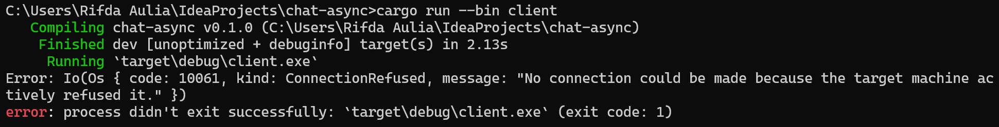

**2.1. Original code of broadcast chat.**  

Setelah server dijalankan dengan perintah `cargo run --bin server` dan setiap klien dijalankan dengan perintah `cargo run --bin client`, dari output di atas dapat dilihat bahwa setiap klien dan juga server menerima siaran obrolan dari setiap klien. Setiap kali seorang klien mengetik pesan pada baris perintah, string tersebut akan dikirim ke server dan server akan terus mengirimkannya ke semua klien yang terhubung padanya.

**2.2. Modifying the websocket port**  

Ketika klien dan server memiliki port yang sama, aplikasi akan berjalan lancar seperti sebelumnya, seperti yang terlihat dalam gambar di bawah ini.

  

Namun, jika misalnya kita hanya mengubah salah satu port, misalnya port klien, akan terjadi kesalahan pada klien karena menurut klien port tersebut tidak memiliki koneksi dan program akan crash ketika diberikan perintah cargo run --bin client seperti dalam foto di bawah ini.

 

 